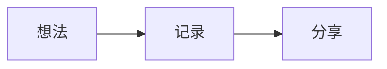

# chalmery

基于 [Astro](https://astro.build/) 构建的个人博客，使用 [Sumi](https://github.com/chalmery/astro-theme-sumi) 主题。

首页以年份归档为主轴，侧栏集中展示个人简介、社交链接与文章分类。支持深浅色模式、响应式布局、Shiki 代码高亮和 Mermaid 图表。

## 本地开发

需要 Node.js 22.12.0 或更高版本。

```sh
npm install
npm run dev
```

生产构建与预览：

```sh
npm run build
npm run preview
```

## 写文章

在 `src/content/posts/` 新建 Markdown 或 MDX 文件，frontmatter 示例：

```md
---
title: 文章标题
description: 一句话介绍这篇文章
pubDatetime: 2026-09-12T12:00:00+08:00
categories:
  - 思考
tags:
  - 日常
draft: false
---

从这里开始写正文。
```

文件名会成为文章链接的一部分。现有文章继续使用从 Hexo 迁移来的数字文件名，因此旧链接保持不变。

使用 `mermaid` 代码围栏可以直接绘制图表：

````md

````

## 配置

站点标题、简介、作者、时区和社交链接集中在 `sumi.config.ts`。头像文件为 `public/avatar.jpg`，主题样式位于 `src/styles/sumi.css`。

## 部署

推送 `main` 分支后，GitHub Actions 会构建 `dist/`，再通过仓库 Secret `GH_PAGES_DEPLOY_KEY` 发布到 `chalmery/chalmery.github.io` 的 `master` 分支。
